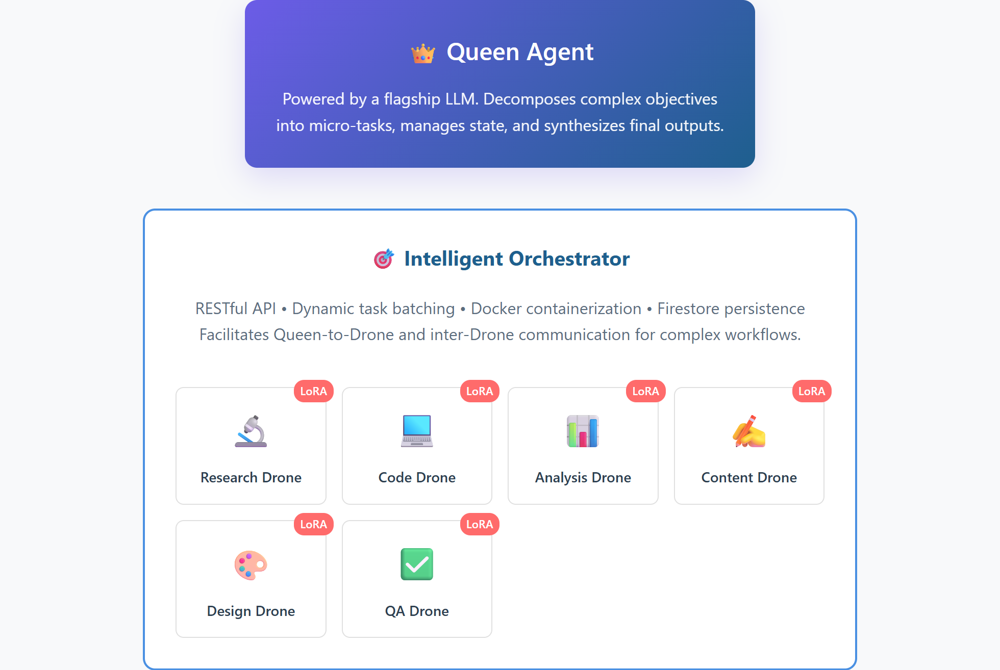

# 👑 Wild Research Framework

[](https://github.com/joshtol/wild-research-framework-overview)
[](https://opensource.org/licenses/MIT)
[](https://www.linkedin.com/in/joshuatollette/)

### An R&D project exploring a Queen-Drone AI swarm architecture for scalable, autonomous intelligence.

This repository contains the interactive architectural overview for the Wild Research Framework. The backend source code is private but is available for review upon request.

[**➡️ Explore the Interactive Architecture Overview**](https://joshtol.github.io/wild-research-framework-overview/)

---

## The Problem: Monolithic AI is Inefficient

Traditional AI agents struggle with complex, multi-faceted tasks. They operate as generalists, leading to wasted API calls, inconsistent results, and a lack of specialized knowledge. This approach doesn't scale effectively for sophisticated, real-world problems.

## The Solution: A Specialised AI Swarm

The Wild Research Framework solves this by implementing a **Queen-Drone architecture**, modeled after a beehive. It creates a clear division of labor where a master AI orchestrates a swarm of dynamically specialized agents to execute tasks with high efficiency and reliability.



---

## ✨ Key Innovations

This framework introduces several key concepts to create a more robust and efficient system.

| Feature                      | Description                                                                                                                              |
| :--------------------------- | :--------------------------------------------------------------------------------------------------------------------------------------- |
| 🎯 **Dynamic Specialization** | LoRA adapters are loaded on-demand, creating hyper-specialized, disposable agents for each task without the overhead of full fine-tuning. |
| ⚡ **Intelligent Batching** | The orchestrator dynamically groups related tasks, reducing redundant API calls by up to 70% and improving overall efficiency.         |
| ⚖️ **Constitutional Governance** | The entire system operates under 20 immutable laws, ensuring predictable, safe, and high-quality outputs, enforced by a dedicated QA Drone. |
| 🧐 **Human-in-the-Loop** | Optional checkpoints allow for human approval on high-stakes tasks, providing critical oversight for cost control and safety.            |
| 🧩 **Model Agnosticism** | The architecture is designed to be model-agnostic, allowing for the best tool for the job, from vendors like Anthropic, Google, or OpenAI. |

---

## ⚙️ How It Works

The process is a seamless flow from a high-level objective to a finished, production-ready output.

1.  **Objective Submission:** A user submits a single, high-level goal via a RESTful API. The input is sanitized to prevent prompt injection.
2.  **Task Decomposition:** The **Queen Agent** analyzes the goal and creates a detailed execution plan, breaking it into dozens of micro-tasks with clear dependencies.
3.  **Human Approval (Optional):** For critical jobs, a human can be prompted to approve the execution plan and its estimated cost.
4.  **Dispatch & Execution:** The **Orchestrator** batches tasks and dispatches them to a swarm of specialized **Drone Agents** that execute in parallel.
5.  **Synthesis & Completion:** The Queen Agent receives the structured outputs from the drones, validates them, and synthesizes them into a final, cohesive deliverable.

---

## 🛠️ Technology Stack

The framework is built on a modern, scalable tech stack designed for high performance and reliability.

* **AI & Models:** Claude Sonnet 4.0 (Queen), Gemma 3 (Drones), Custom LoRA Library
* **Backend & Orchestration:** Go 1.24+, Python
* **Containerization:** Docker, Docker Compose
* **API & Persistence:** RESTful API, Firestore

---

## 🗺️ Project Roadmap

This is an active R&D project with a clear vision for future development.

-   [ ] **Drone SDK:** Develop a Software Development Kit to allow for the rapid creation and registration of new specialized drones.
-   [ ] **Kubernetes Migration:** Evolve the orchestration from Docker Compose to Kubernetes to enable dynamic, auto-scaling of drone instances for enterprise-level workloads.
-   [ ] **Advanced Inter-Drone Communication:** Implement protocols for collaborative task execution between drones for more complex problem-solving.

---

## 🚀 Getting Started

While the backend for this project is private, this repository can be cloned and run locally to view the interactive overview.

### Prerequisites

-   A modern web browser.

### Setup

1.  Clone the repository to your local machine:
    ```bash
    git clone [https://github.com/joshtol/wild-research-framework-overview.git](https://github.com/joshtol/wild-research-framework-overview.git)
    ```
2.  Open the `index.html` file in your browser to view the project overview.

---

## 🤖 Accessing this Project for AI and Automated Analysis

This project is open for analysis by AI agents, swarms, and other automated tools. To ensure reliable access, please use one of the following programmatic methods instead of web scraping.

#### 1. Git Clone (Recommended for full analysis)

For a complete and up-to-date copy of the project, clone the repository:

```bash
git clone [https://github.com/joshtol/wild-research-framework-overview.git](https://github.com/joshtol/wild-research-framework-overview.git)
```

#### 2. GitHub API (For targeted file access)

To programmatically list and download individual files, please use the official GitHub API.

* **Repository Contents Endpoint:** `https://api.github.com/repos/joshtol/wild-research-framework-overview/contents/`

---

## 🤝 Contributing

This is currently a private R&D project, but I am open to collaboration and suggestions. If you have ideas for improving the framework or would like to discuss the architecture, please feel free to reach out via LinkedIn or open an issue on GitHub.

---

## 📜 License

This project is licensed under the MIT License. See the [LICENSE](LICENSE) file for details.

---

## 📞 Contact

**Joshua Tollette**

* **LinkedIn:** [https://www.linkedin.com/in/joshuatollette/](https://www.linkedin.com/in/joshuatollette/)
* **GitHub:** [https://github.com/joshtol](https://github.com/joshtol)